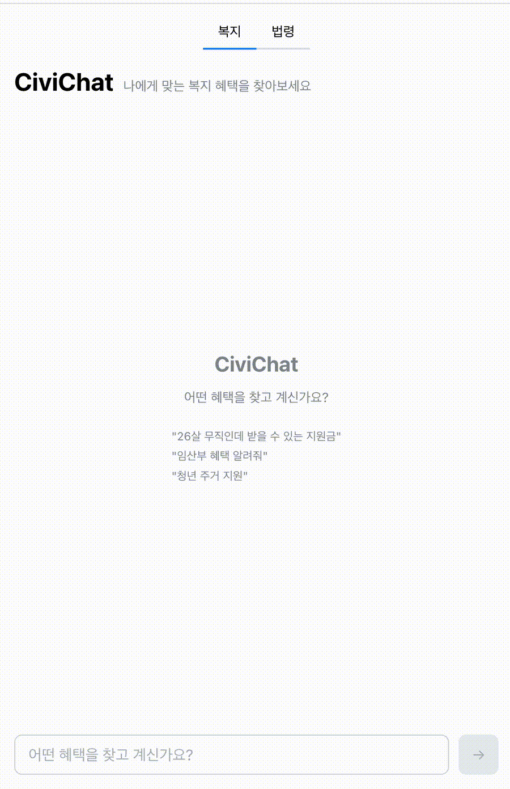
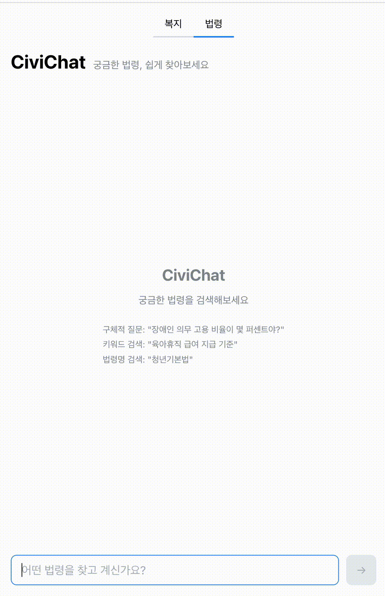
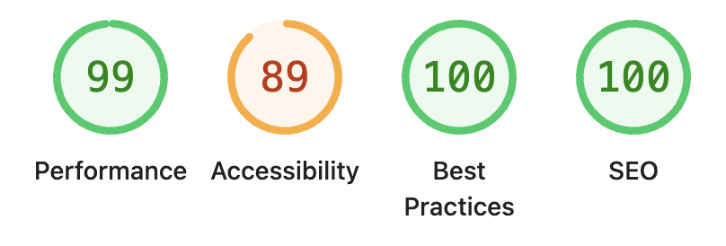

# CiviChat

자연어 질문으로 정부 복지 혜택과 법령을 검색하는 **생성형 AI 대화형 서비스**입니다.

Next.js API Route에서 SSE로 AI 요약을 스트리밍하고, Supabase pgvector 기반 RAG 검색 결과를 대화 UI에 단계별로 렌더링합니다. Lighthouse Performance 99, CLS 0, 스트리밍 중 스크립팅 비용 85% 감소(Canvas 기반 높이 사전 계산), Vitest + RTL 67개 테스트.

> 복지 10,919건 + 법령 31,066건 (687개 법령) | Vercel 배포

---

## Demo

[Live Demo](https://civichat-kappa.vercel.app)

<p>
  
  
</p>

---

## Problem

기존 복지 정보 서비스는 메뉴 탐색 중심이라 사용자가 원하는 답을 빠르게 찾기 어렵습니다. CiviChat은 대화형 인터페이스로 자연어 질문을 받고, AI가 검색 결과를 요약해 돌려줍니다. 생성형 AI 응답을 프론트엔드에서 어떻게 수신하고 단계별로 렌더링할지, 검색 결과를 대화 흐름 안에서 어떻게 보여줄지를 설계하는 것이 핵심 과제였습니다.

---

## Highlights

- **Next.js API Route + SSE**로 AI 요약 스트리밍 UI 구현
- **Supabase pgvector** 기반 벡터 검색과 키워드 검색을 **RRF**로 결합
- AI 응답 상태를 **로딩 / 요약 / 결과 카드**로 분리해 체감 응답성 개선
- **Canvas 기반 메시지 높이 사전 계산**으로 가상 스크롤 안정화 (스크립팅 85% 감소)
- `aria-live`, `role="status"`, **Skip Link**, 포커스 복원으로 대화형 UI 접근성 보완
- Vitest + React Testing Library로 유닛/컴포넌트 **테스트 67개**

---

## Architecture

```
Client Chat UI
  -> Next.js API Route (SSE)
    -> core/search (순수 TypeScript, React 무관)
      -> Supabase pgvector + keyword search (RRF 합산)
      -> OpenAI summary streaming
    -> SSE Response Stream
  -> Typewriter UI + Result Cards (순차 애니메이션)
```

### 핵심 설계: `src/core/`에 비즈니스 로직 격리

- `core/`는 React/Next.js에 의존하지 않는 순수 TypeScript
- CLI와 API Route가 같은 함수를 공유 -- 새 기능은 CLI에서 먼저 검증 후 UI에 연결
- API Route는 입력 파싱 + core 호출 + SSE 응답 포장만 담당

```
src/
├── core/                # 비즈니스 로직 (React/Next 무관)
│   ├── benefit/         #   복지 검색 + 조건 추출 + LLM 요약
│   ├── legal/           #   법령 파싱 + 검색 + LLM 요약
│   ├── embeddings/      #   OpenAI text-embedding-3-small
│   ├── gov/             #   보조금24 API 연동
│   └── db/              #   Supabase 클라이언트
│
├── app/                 # Next.js App Router
│   ├── api/benefit/     #   복지 SSE API
│   ├── api/legal/       #   법령 SSE API
│   └── ...
│
├── components/          # React 컴포넌트
│   ├── benefit/         #   ChatContainer, MessageList, BenefitCard, StaggeredResults
│   ├── legal/           #   ChatContainer, LawArticleCard
│   └── home/            #   TabNav
│
└── lib/
    ├── text-layout/     #   Canvas 텍스트 측정 + 높이 사전 계산
    ├── use-sse-stream.ts #  SSE 스트림 파싱
    └── use-typewriter.ts #  어절 단위 타이프라이터
```

---

## Challenges

### SSE 스트리밍 중 스크롤 위치 흔들림

AI 응답이 스트리밍으로 도착하면서 메시지 높이가 계속 변하고, `@tanstack/react-virtual`의 `estimateSize`와 실제 높이 사이의 격차 때문에 스크롤이 점프했습니다. DOM에 렌더하기 전에 Canvas `measureText`로 텍스트 폭을 측정하고, 이진탐색으로 줄바꿈 위치를 계산해 메시지 높이를 사전 추정하는 방식으로 해결했습니다.

### 벡터 검색만으로는 구조적 조건 매칭 불가

"26살 서울 무직"처럼 구조화된 조건이 포함된 질문에서 벡터 유사도만으로는 정확한 필터링이 어려웠습니다. 사용자 입력에서 나이/성별/직업/지역을 정규식으로 즉시 추출하고, JA 코드 기반 구조화 필터 + 벡터/키워드 하이브리드 검색(RRF)을 조합해 정확도를 높였습니다.

---

## Technical Decisions

### 1. AI 응답 상태를 단계별로 분리

SSE 스트리밍 응답을 3단계 UI 상태로 분리했습니다: **로딩(스피너) -> LLM 요약(타이프라이터) -> 결과 카드(순차 애니메이션)**. 첫 텍스트 청크가 도착하면 스피너를 즉시 제거하여 사용자가 응답 시작을 바로 인지할 수 있도록 했습니다. 애니메이션 진행 중에는 입력을 비활성화해 중복 요청을 방지합니다.

### 2. DOM 렌더 전 텍스트 너비 측정과 높이 사전 계산

Canvas `measureText`로 각 문자의 폭을 측정하고 `Float64Array` 누적합 배열에 저장합니다. 컨테이너 폭 기준으로 이진탐색(O(log n))을 수행해 줄바꿈 위치를 계산하고, 줄 수 + 카드/아코디언 높이를 합산해 메시지 높이를 추정합니다. 이 값을 `@tanstack/react-virtual`의 `estimateSize`에 전달하여, 스트리밍 타이핑 중에도 스크롤 위치를 안정화합니다. `getBoundingClientRect` 대비 스크립팅 비용 85% 감소 (1,282ms -> 193ms).

### 3. 벡터 검색과 키워드 검색을 RRF로 결합

벡터 검색만으로는 "서울 청년" 같은 구조적 조건 매칭이 약하고, 키워드 검색만으로는 서술형 질문 처리가 불가능합니다. Supabase RPC 함수에서 pgvector 코사인 유사도 + tsvector 키워드 검색 결과를 RRF(Reciprocal Rank Fusion)로 합산하고, JA 코드 구조화 필터 + 연령/컨텍스트 후처리로 정확도를 높였습니다.

### 4. 검색 로직을 React 밖으로 분리

`src/core/`에 검색/추출/요약 로직을 순수 TypeScript로 격리했습니다. CLI와 API Route가 동일한 함수를 호출하므로 새 기능은 터미널에서 먼저 검증한 후 UI에 연결합니다. React/Next.js 의존이 없어 테스트 속도도 빠릅니다.

---

## Accessibility & Performance

### 접근성

대화형 AI 서비스는 비동기 상태 변화가 잦아, 스크린 리더 사용자가 응답 시작과 완료를 인지하기 어렵습니다.

- **시맨틱 구조**: `role="main"`, `role="search"`, `role="log"`, `role="article"`
- **ARIA 속성**: `aria-live="polite"`, `aria-busy`, `aria-label`
- **Skip Link**: 포커스 시 화면에 노출, 검색 입력으로 바로 이동
- **로딩 상태**: `role="status"` + `aria-label="검색 중"`
- **포커스 관리**: AI 응답 완료 후 입력창 자동 포커스 복원
- **다크모드**: Mantine 시맨틱 컬러 (하드코딩 없음)

### Performance



| Lighthouse | 점수 |
| --- | --- |
| Performance | **99** |
| Best Practices | **100** |
| SEO | **100** |
| Accessibility | 89 |
| CLS | **0** |

| 텍스트 높이 측정 | getBoundingClientRect | Canvas measureText | 차이 |
| --- | --- | --- | --- |
| Scripting | 1,282ms | 193ms | **85% 감소** |
| Rendering | 35ms | 27ms | 23% 감소 |
| Painting | 18ms | 13ms | 28% 감소 |

### 테스트

Vitest + React Testing Library | 67개 테스트

| 모듈 | 항목 | 건수 |
| --- | --- | --- |
| search/extract | 조건 추출, 키워드 분류, 대화 누적, 검색/질문 판단 | 29 |
| text-layout | LRU 캐시, 이진탐색 줄바꿈, 마크다운 파싱, 높이 추정 | 18 |
| ChatInput | 빈 입력 차단, trim 제출, disabled 상태 | 5 |
| BenefitCard | 조건부 렌더링, 외부 링크, fallback | 10 |
| TabNav | 경로별 활성 탭, 탭 클릭 라우팅 | 5 |

---

## Stack

| 영역 | 기술 |
| --- | --- |
| Framework | Next.js 15 (App Router, RSC) |
| Language | TypeScript (strict) |
| UI | Mantine v7 |
| Vector DB | Supabase (pgvector + HNSW) |
| Embedding | OpenAI text-embedding-3-small (1536d) |
| LLM | GPT-4o-mini (SSE streaming) |
| Virtualization | @tanstack/react-virtual |
| Test | Vitest + React Testing Library |
| Deploy | Vercel + Supabase Cloud |

---

<details>
<summary>검색 파이프라인 상세</summary>

### 복지 검색: 조건 추출 + 하이브리드 검색 + 4단계 필터

```
사용자 입력 ("26살 무직인데 서울에서 받을 수 있는 지원금")
  |
  v
조건 추출 (정규식 기반, LLM 호출 없음)
  -> age: 26, occupation: "구직자", region: "서울"
  -> 대화 히스토리에서 이전 조건 누적 (멀티턴)
  -> 조건 부족 시 추가 질문 반환
  |
  v
POST /api/benefit/search (SSE 스트리밍)
  |
  +---> 하이브리드 검색 (match_benefits_hybrid RPC)
  |     벡터 검색 (pgvector 코사인 유사도)
  |     + 키워드 검색 (tsvector, 서비스명 A가중치)
  |     + RRF 합산 (rrf_k=60)
  |
  +---> 4단계 후처리 필터
  |     1. JA 코드 필터: 나이/성별/직업 구조화 조건 매칭
  |     2. 연령 텍스트 필터: 연령 부적합 서비스 제외
  |     3. 컨텍스트 필터: 미언급 특수 대상 제외
  |     4. 서비스명 부스트: 쿼리 키워드와 서비스명 매칭 시 가산
  |
  v
LLM 요약 스트리밍 (gpt-4o-mini) -> 결과 카드 순차 표시
```

### 법령 검색

```
사용자 입력 ("장애인 고용 의무")
  -> 하이브리드 검색 (match_law_articles_hybrid RPC)
  -> LLM 요약 스트리밍 (법률 용어 -> 일상 언어)
  -> 아코디언 조문 목록
```

</details>

<details>
<summary>로컬 실행</summary>

```bash
pnpm install
cp .env.example .env.local
# SUPABASE_URL, SUPABASE_SERVICE_ROLE_KEY, OPENAI_API_KEY, GOV24_API_KEY

pnpm run dev
pnpm run cli search "26살 무직 지원금"
pnpm run cli legal-search "청년 주거 지원 법령"
```

</details>
